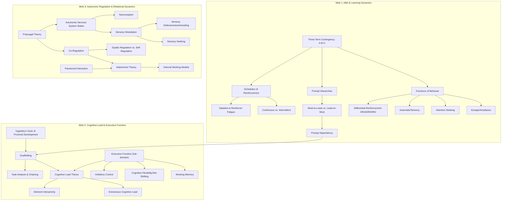

# Behavioral and Developmental Analysis of HelperWatch

This document evaluates the alignment of the HelperWatch initiative with established concepts in behavioral psychology, child development, cognitive science, and developmental psychology. Based on a review of the current project documentation, this analysis highlights key strengths, identifies areas where field-derived assumptions diverge from professional clinical frameworks, and recommends topics for further self-directed exploration.

---

## 1. Executive Summary

The project documentation demonstrates a remarkably sophisticated, empathetic, and pragmatic understanding of the daily realities of caring for severely impacted special needs children. The "field experience" driving the project has successfully bypassed the common pitfall of clinical over-abstraction. Rather than treating behaviors as clinical checklist items, the documents frame them as functional, context-dependent adaptations (e.g., recognizing echolalia and scripting as self-regulatory tools rather than compliance failures).

However, because the architecture is built on intuitive field observations, it occasionally merges distinct psychological concepts or misses established behavioral and developmental frameworks that could make the system more effective, predictable, and safe. The primary areas where professional concepts can enhance the project are:
1. **Behavioral Science:** Moving from generic "prompting" and "reinforcement" to formal prompt hierarchies, reinforcement schedules, and functional behavior assessments.
2. **Cognitive Psychology:** Deconstructing the monolith of "executive dysfunction" into specific sub-components that require distinct scaffolding strategies.
3. **Developmental Psychology:** Rectifying the framing of "co-regulation," which is currently treated as a mechanical/verbal parental override rather than a dyadic biological process.
4. **Relational Psychology:** Evaluating the long-term impact of parasocial interaction and artificial attachment figures on the parent-child attachment bond.

---

## 2. Current Strengths and Conceptual Alignment

The system design aligns closely with several core clinical practices, demonstrating that the underlying behavioral intuition is highly sound:

*   **Antecedent Control (Room-Aware Scaffolding):** In Applied Behavior Analysis (ABA), managing the environment to make target behaviors more likely is called antecedent control. By using ESP32 room scanners to deliver context-appropriate cues, HelperWatch automatically aligns prompt delivery with environmental antecedents.
*   **Behavioral Intercept (Meltdown Arc):** Mapping the meltdown as a physiological arc (Build-up → Peak → Recovery) rather than a binary state is clinically accurate. The decision to **suppress verbal cues during the peak** is a crucial safety feature that prevents sensory overload from escalating neurological distress.
*   **Functional Interpretation of Echolalia:** Treating immediate and delayed echolalia/scripting as communicative, processing, or self-regulatory tools—rather than non-compliant behavior—aligns with modern speech-language pathology and neurodiversity-affirming practices.
*   **Dynamic Fading:** The core concept of reducing prompts as the child demonstrates mastery matches the clinical goal of prompt fading, which prevents prompt dependency.

---

## 3. Conceptual Gaps and Areas of Friction

The following areas represent where the lack of professional terminology or theoretical framing creates potential friction in the system's design:

### A. The Misunderstanding of "Co-Regulation"
The documentation frequently uses the term "co-regulation" (specifically in the Intercom System and Meltdown Recovery sections) to describe a caregiver delivering verbal instructions or using the watch as a remote coaching tool. 
*   **The Clinical Reality:** Co-regulation is not just "instructing" or "prompting" from afar. In developmental psychology, co-regulation is a bidirectional, dyadic, somatic process. It relies on the caregiver's own regulated autonomic nervous system (visage, vocal prosody, heart rate variability, touch) to soothe and stabilize the child's dysregulated nervous system via mirror neurons and neuroception.
*   **The System Risk:** If the project team designs features under the impression that an AI voice or a remote walkie-talkie cue is "co-regulation," they may inadvertently replace crucial somatic parent-child regulation loops with a digital buffer. An AI voice cannot provide the emotional reciprocity or shared affect required for true co-regulation.

### B. Treating Executive Dysfunction as a Monolith
The documents discuss "executive dysfunction" as a single variable that causes task abandonment, transition resistance, and routine failure.
*   **The Clinical Reality:** Executive function is a suite of distinct cognitive processes, primarily:
    1.  **Working Memory:** Holding and manipulating information over short intervals.
    2.  **Cognitive Flexibility (Set-Shifting):** Shifting attention between different tasks or rules.
    3.  **Inhibitory Control:** Resisting impulses and sustaining focus.
*   **The System Risk:** A child can have strong working memory but severe set-shifting difficulties. Delivering the same "step-by-step prompt" to address both issues is inefficient. Shifting tasks (transition resistance) requires antecedent warnings and cognitive bridges, whereas task abandonment (working memory decay) requires spatial re-anchoring. The child profile should separate these sub-components to tailor the protocols.

### C. The Simplification of Reinforcement and Prompting
The prompting and reinforcement (micro-affirmations) models in the documents are highly linear and continuous.
*   **The Clinical Reality:** 
    *   **Prompt Hierarchies:** Prompts are categorized from least-to-most intrusive (visual → verbal → gestural → modeling → physical) or vice versa. The system should define which direction it is fading.
    *   **Reinforcement Schedules:** Constant positive reinforcement ("Good job!" after every single step) quickly leads to **satiation** (the reward loses value) or **reinforcer fatigue**. It can also disrupt the flow of a routine by introducing unnecessary verbal noise.
*   **The System Risk:** Without a structured prompting hierarchy, the AI may jump randomly between levels of prompts (e.g., moving from a verbal hint to a direct command too quickly), causing frustration. Constant micro-affirmations might also desensitize the child to validation, rendering the reinforcement ineffective over time.

### D. Parasocial Attachment and the AI Voice
The bedtime companion mode (US-10) and attention-seeking check-ins (US-3) involve the AI voice acting as a source of emotional presence, comforting reassurance, and validation.
*   **The Clinical Reality:** Children, particularly those with social-communication differences, can easily form deep parasocial attachments to consistent, non-judgmental interactive agents.
*   **The System Risk:** If the watch becomes the child's primary source of validation, interest, and soothing, it could interfere with human-to-human attachment dynamics. The ethical framework mentions "humoring" but does not fully address the developmental impact of a child developing a primary attachment relationship with a wearable device.

---

## 4. Interconnected Topic Webs for Further Exploration

To deepen your understanding of these dynamics, explore the following three interconnected webs of psychological and behavioral concepts. You can follow these terms from one node to the next in literature, articles, or open-source wikis.

### Web 1: Applied Behavior Analysis (ABA) & Prompting Dynamics
*   **The Three-Term Contingency (A-B-C):** Understanding behavior (B) as a function of what happens immediately before it (Antecedent - A) and immediately after it (Consequence - C). The Cloud Backend's routing engine is essentially a digital manager of ABC contingencies.
*   **The Four Functions of Behavior:** Every behavior serves one or more of four purposes: *Escape/Avoidance, Attention, Access to Tangibles, or Sensory/Automatic Reinforcement*. Understanding these functions helps clarify why the child is avoiding a task or seeking attention.
*   **Functional Communication Training (FCT):** A behavioral intervention where a child is taught an alternative, appropriate communication response (e.g., using a watch gesture or specific phrase) to replace a challenging behavior that serves the same function (e.g., throwing a cup to escape brushing teeth).
*   **Prompt Hierarchies (Least-to-Most vs. Most-to-Least):** The structured progression of prompts. Exploring how to fade prompts systematically without creating *Prompt Dependency* (where the child wait-states for the prompt before acting).
*   **Schedules of Reinforcement:** Moving from *Continuous Reinforcement* (reinforcing every step, which causes *Satiation*) to *Intermittent or Variable Reinforcement* (reinforcing unpredictably), which builds long-term habits that persist even when the device is removed.
*   **Differential Reinforcement (DRA/DRI/DRO):** Strategies for reinforcing positive alternative behaviors while putting undesired behaviors on extinction (withdrawing reinforcement), which is critical for handling attention-seeking behaviors (US-3) without triggering severe *Extinction Bursts*.

### Web 2: Executive Function, Cognitive Load, & Learning
*   **Vygotsky's Zone of Proximal Development (ZPD):** The distance between what a learner can do without help and what they can do with help. Scaffolding is only effective if it targets the ZPD; prompts that are too simple lead to dependence, while those that are too complex cause anxiety.
*   **Cognitive Load Theory (CLT):** Focuses on how working memory load affects learning. Explore *Extraneous Cognitive Load* (the unnecessary mental effort introduced by how information is presented—like an AI voice talking too long or too frequently) and *Element Interactivity* (how complex the step feels to the child).
*   **Executive Function Sub-domains:** Distinguishing between *Working Memory* (which needs memory-jogging prompts), *Inhibitory Control* (which needs impulse-blocking and pause prompts), and *Cognitive Flexibility/Set-Shifting* (which needs transition warnings and cognitive bridges).
*   **Task Analysis and Backward/Forward Chaining:** The process of breaking a skill down into smaller, individual steps (Task Analysis) and teaching them sequentially (Chaining). This is highly relevant to how routines are defined and stepped through in the Cloud Backend.

### Web 3: Autonomic Regulation, Sensory Processing, & Relational Dynamics
*   **Polyvagal Theory:** Explores how the Autonomic Nervous System (ANS) regulates behavioral states (e.g., Safe/Social, Fight/Flight, Freeze/Shutdown). This provides the physiological foundation for the meltdown arc and sensory shutdown.
*   **Neuroception:** The subconscious detection of safety or threat in the environment. Essential for understanding how the tone, speed, and volume of the watch's voice affects the child's arousal level.
*   **Co-Regulation vs. Self-Regulation:** The developmental progression from needing a caregiver's somatic presence to regulate emotions (co-regulation) to doing it independently (self-regulation).
*   **Sensory Modulation & Sensory Processing Sensitivity (SPS):** The brain's capacity to regulate its responses to sensory input. Understanding the difference between *Sensory Defensiveness* (leading to shutdown, US-8) and *Sensory Seeking* (leading to pacing/stim-seeking, US-3) helps refine the sensory profile.
*   **Parasocial Interaction & Attachment Theory:** The psychological study of how individuals form one-sided relationships with media or technological agents, and how these interact with *Internal Working Models* of human relationships and caregiver attachment.

---

## 5. Practical Design Recommendations for HelperWatch

To translate these concepts into system design:

1.  **Refine the Vocabulary:** Change documentation references to "co-regulation via intercom" to **"Remote Caregiver Presence"** or **"Intercom Co-Regulation Tool"**. Clearly state in the ethics guide that the device is a scaffold for task execution, not a replacement for somatic, face-to-face emotional co-regulation.
2.  **Structure the Sensory Modulation Profile:** Instead of listing sensory inputs ad-hoc, categorize the child’s sensory profile into *Sensory Avoiding* (demands silence/haptics, low-volume) and *Sensory Seeking* (demands rhythmic audio, tactile feedback).
3.  **Incorporate Prompt Hierarchies in the Routine Engine:** Allow caregivers to choose a prompting strategy:
    *   *Least-to-Most (LTM):* Visual → Verbal Hint → Direct Verbal Command (best for maintaining independence).
    *   *Most-to-Least (MTL):* Direct Command → Verbal Hint (best for learning brand-new routines).
4.  **Variable Reinforcement for Micro-Affirmations:** Instead of the system delivering a micro-affirmation after every single step, implement an option for **Variable Ratio Reinforcement** (e.g., affirming randomly after 30-50% of completed steps, or only at the end of a chain of steps) to prevent satiation and maintain momentum.
5.  **Address Parasocial Attachment in the Ethics Guardrails:** Add a specific section to [Safety and Ethics Overview](file:///c:/dev/HelperWatch/docs/ethics/Safety%20and%20Ethics%20Overview.md) regarding the watch voice's social footprint. Instruct caregivers to avoid framing the watch as a "friend" or "person," and recommend that the voice style remain friendly but distinctly machine-like to prevent parasocial confusion.
