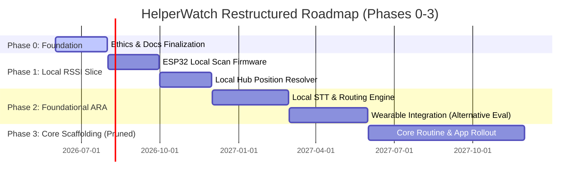

# HelperWatch Revised Project Assessment & Strategic Pivot Report

This document updates the initial feasibility and project review of the **HelperWatch** initiative, incorporating caregiver and developer comments on the [project_review_report.md](file:///C:/Users/Alex/.gemini/antigravity-ide/brain/1f62da68-6a63-4a94-8523-6210cb7b8926/project_review_report.md) artifact. 

Based on this review, the project is executing a major pivot from its original "Cloud-First, Zero-Local-Config" posture to a **"Local-First Hub, Cloud-Synced"** architecture. This shift addresses the critical technical constraints of wearable hardware, power consumption, network latency, and scope bloat while preserving the core mission.

---

## 1. Core Architectural Pivot: The Local Hub Model

The comments confirm a strategic consensus: **A dedicated Local Hub is now a core requirement of the HelperWatch network.**

```
       ┌────────────────────────────────────────────────────────┐
       │                      Local Hub                         │
       │  (Raspberry Pi / Home Assistant / Local Mini-PC)       │
       │                                                        │
       │ ┌──────────────────┐  ┌──────────────────────────────┐ │
       │ │  Local RSSI      │  │ Local Audio & VAD Processing │ │
       │ │  Resolver        │  │ (Whisper-Local / STT Router) │ │
       │ └────────▲─────────┘  └──────────────▲───────────────┘ │
       │          │                           │                 │
       │ ┌────────┴───────────────────────────┴──────────────┐ │
       │ │       Local Adaptive Response Engine (ARA)         │ │
       │ └────────────────────────────▲───────────────────────┘ │
       └──────────────────────────────┼─────────────────────────┘
                                      │ Syncs States / Configs
                                      ▼
                           ┌─────────────────────┐
                           │    Cloud Backend    │
                           │  (Supabase / Sync)  │
                           └─────────────────────┘
```

### Positioning Resolution
* **Previous Design:** 4–6 ESP32s streamed raw RSSI packet logs across the WAN to the Cloud Backend multiple times per second.
* **Revised Design:** ESP32 nodes report BLE RSSI to the **Local Hub** over local Wi-Fi/UDP. The Local Hub acts as the local position resolver. It processes high-frequency signals locally, determines room transitions, and sends only the *state transitions* (e.g., `"John moved to Bathroom"`) as discrete data points to the cloud or local logging feed.
* **Feasibility Impact:** Eliminates WAN network chatter by >99%, reduces cloud hosting bandwidth costs, and guarantees that room-level tracking operates during internet outages.

### Audio & Latency Management
* **Previous Design:** Raw audio streamed to the cloud for transcription (Whisper via Groq), routed to the Cloud LLM, and sent back as a text cue.
* **Revised Design:** The Local Hub acts as the primary coordinator for audio input processing. It runs a local, lightweight Voice Activity Detection (VAD) service and, where hardware permits, a local speech-to-text model (e.g., Whisper-local or Whisper.cpp running on a Raspberry Pi 4/5 or local gateway).
* **Feasibility Impact:** Resolves the critical 3–5 second network round-trip latency. Contextual redirection cues can be triggered within sub-second thresholds.

### Local ARA Execution
* **Previous Design:** The Adaptive Response Architecture (ARA) decision engine was hosted entirely in the Cloud.
* **Revised Design:** The majority of the ARA components (such as prompt hierarchies, routine step validation, and reinforcement scheduling) run locally on the Hub. The Cloud Backend is relegated to a synchronization layer for configuration, caregiver app metrics, and account backup.

---

## 2. Re-evaluating the Wearable Hardware: Moving Beyond WearOS

The reviews indicate that WearOS introduces significant, potentially disqualifying hurdles:
1. **OS-Level Throttling:** Aggressive background process termination and Wi-Fi shutdown during doze mode.
2. **Wi-Fi Battery Drain:** Smartwatch batteries cannot support active WSS streaming for 12–16 hours.
3. **Audio Pollution:** Wearable mics capture massive background noise in active households.

### Proposed Hardware Alternative Framework
Rather than relying on WearOS smartwatches running native background services, the local hub architecture allows us to explore a **two-layer wearable alternative**:

* **Option A: Dumb Wearable Broadcaster + Ambient Receivers**
  * The child wears a simple, low-cost BLE beacon wristband (no screen, no Wi-Fi, battery life measured in months).
  * The room nodes (ESP32-S3) are upgraded to include built-in directional microphones and speakers.
  * *How it works:* The ESP32 node detects the child's presence, listens to the room audio directly, resolves VAD locally, and sends audio to the Local Hub. The local hub plays prompt audio through the speaker of the room node where the child is located.
  * *Pros:* Eliminates watch charging entirely, bypasses WearOS restrictions, eliminates wrist-worn audio streaming battery issues, and is highly cost-effective.

* **Option B: Specialized Companion Hardware (ESP32-Based Wearable)**
  * A custom-cased, low-power ESP32-based wearable (e.g., utilizing ESP32-S3 with ESP-Skainet for local wake-word and VAD).
  * *How it works:* Uses low-power ESP-NOW or local Wi-Fi only when active. Does not run a heavy mobile OS, resolving background throttling.
  * *Pros:* Absolute control over power states, wake locks, and transmission protocols.

* **Option C: Hybrid WearOS (Severely Restricted)**
  * If WearOS is retained, it must operate purely as a BLE advertiser (which the OS does not throttle) and a Bluetooth audio receiver. The watch's Wi-Fi is kept turned off. The watch acts as a dumb speaker/earbud driver for the local hub. Audio capture is moved to wall nodes or triggered only via manual tap.

---

## 3. Pruning and Restructuring the Roadmap (Targeting 1-2 Year Release)

To avoid volunteer burnout and scope creep, we are pruning Phase 3 of the [Project Roadmap.md](file:///c:/dev/HelperWatch/docs/project/Project%20Roadmap.md) to target a release that "helps people within a year or two, not perfection."

### Roadmap Revision



### Pruned Features (Deferred to v2.0+)
The following features are officially deferred to prevent launch stall:
* **Multi-Voice Sibling Conflict Detection:** Too complex to run reliably on budget hardware; replaced by a simple "Loud Noise Alert" threshold.
* **Rolling-Window Biometric Meltdown Prediction:** Complex data science task. Replaced by simple heart-rate threshold limits (e.g., notify if HR > X bpm for 1 minute).
* **Statistical Prompt Dependency Detection:** Replaced by manual caregiver reviews.
* **Sensory Shutdown Heuristics:** Replaced by a manual "Mute Cues" toggle or basic timeout logic.

### Core Release Target (v1.0 Focus)
The v1.0 engine will support only the three most common high-friction caregiver scenarios:
1. **Morning Routine Sequencing** (toilet, brush teeth, get dressed, breakfast).
2. **Transition Countdown warnings** (using first-step anchoring and bridging cues).
3. **Bedtime boundary holding** (room-exit detection and basic request management).

---

## 4. Documentation Quality & Maintenance Strategy

To resolve the duplicate descriptions flagged in the initial review, the project is adopting a new documentation layout standard:

* **Generic/Abstract References:** Conceptual details of the system (such as the BLE advertising cycle and WSS transmission) will be defined in a single, authoritative reference document. 
* **The authority file:** [System Architecture.md](file:///c:/dev/HelperWatch/docs/design/System%20Architecture.md) will serve as the single source of truth for component behaviors.
* **Abstract Referencing:** Documents like [Wearable App.md](file:///c:/dev/HelperWatch/docs/design/Wearable%20App.md) or [Privacy and Data Sovereignty.md](file:///c:/dev/HelperWatch/docs/ethics/Privacy%20and%20Data%20Sovereignty.md) will refer back to the architecture document using abstract summaries (e.g., *"BLE advertising operates as outlined in the central architecture model..."*) rather than repeating technical implementation details. This minimizes documentation churn and updates cost.

---

## 5. Revised Risk Register

The critical risks have been updated to reflect the Local Hub pivot and hardware re-evaluation:

| Risk Element | Target Component | Status | Revised Reality |
| :--- | :--- | :--- | :--- |
| **Wearable Battery & OS Limits** | Wearable App | **Open (High)** | Bypassed if using directional microphones on wall nodes (Option A) or custom firmware (Option B). Remaining a high risk if WearOS is selected; requires strict VAD gating and disabling standalone Wi-Fi. |
| **Signal Calibration Drift** | Indoor Positioning | **Partially Mitigated** | Shifting resolution to the Local Hub allows us to use more resource-intensive, smoothing algorithms (such as Kalman filters or multi-sensor fusion combining BLE RSSI with PIR motion sensors on nodes) to combat signal absorption. |
| **Acoustic Overload & Voice Isolation** | Wearable App / Nodes | **Open (High)** | In a noisy home, background noise remains a blocker. Local hub processing allows us to run multi-mic noise reduction algorithms, but it is a critical task for the local audio router. |
| **Hub Setup & Configuration Complexity** | Onboarding & Guides | **High Risk** | Introducing a local hub (Raspberry Pi/Home Assistant) increases the deployment complexity for caregivers. To combat this, the project must target standard platforms (e.g., providing a pre-configured Home Assistant Add-on or a pre-loaded SD card image). |
| **LLM Guardrail Reliability** | Cloud / Local ARA | **Mitigated** | Local ARA execution enforces that the LLM is only utilized for structural classification (JSON routing) while the actual verbal playback is selected from static, parent-approved templates stored locally. |
